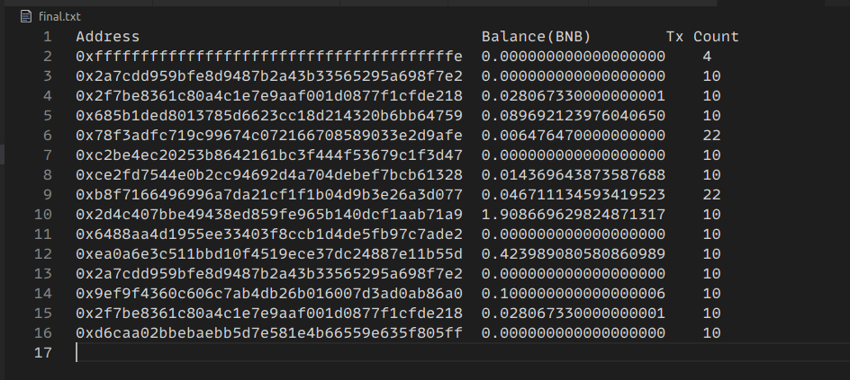

The final.js script reads a list of Binance Smart Chain (BSC) addresses from a file named Addresses.txt, fetches the balance and the transaction count for each address using the BSC API, and writes the results to a file named final.txt. The script filters the addresses that have a balance greater than or equal to 2 BNB and at least one transaction within the last 30 days. The getBalanceAndTransactions function fetches the balance and transaction count for an address using the BSC API and writes the results to final.txt if the address meets the filter criteria. The script uses readAddressFile function to read the addresses from the Addresses.txt file and split them into an array. It then loops through the array of addresses and calls getBalanceAndTransactions for each address with a delay of 500 milliseconds between calls. The addresses array is defined as the result of calling readAddressFile function with "Addresses.txt" as the argument.

The fetchTransactionCount.js script reads the BSC addresses from the Addresses.txt file and fetches the transaction count for each address using the BSC API. It makes an API call for each address with a delay of 200 milliseconds between calls to avoid rate-limiting. The script uses fs.readFileSync to read the addresses from the Addresses.txt file and split them into an array. It then loops through the array of addresses and calls the BSC API for each address with a delay between calls.

The fetchBalances.js script reads the BSC addresses from the Addresses.txt file and fetches the balance for each address using the BSC API. It makes an API call for each address with a delay of 200 milliseconds between calls to avoid rate-limiting. The script uses fs.readFileSync to read the addresses from the Addresses.txt file and split them into an array. It then loops through the array of addresses and calls the BSC API for each address with a delay between calls. The balance for each address is written to the console.

Here is an example of the output without any conditions:

